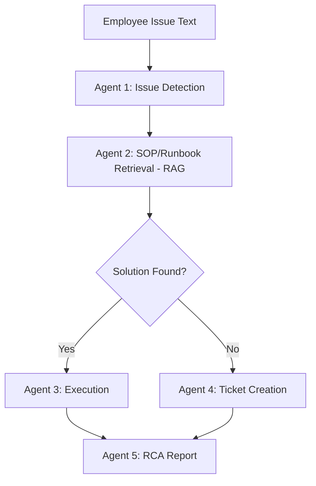

# Enterprise IT Support & RCA Agent

AI-powered multi-agent system that detects IT issues, retrieves troubleshooting
steps via RAG, attempts automated remediation, raises tickets when it can't
resolve something, and generates a Root Cause Analysis (RCA) report.

Built for the **HCLTech–OpenAI Agentic AI Hackathon** (Track 2 — Internal Operations).

## Status

- [x] Shared agent state (Pydantic model)
- [x] Agent 1 — Issue Detection (OpenAI `gpt-4o-mini`, structured JSON output)
- [ ] Agent 2 — SOP/Runbook Retrieval (RAG via ChromaDB)
- [ ] Agent 3 — Execution Agent (simulated remediation)
- [ ] Agent 4 — Ticket Agent (in-memory store for now, MongoDB later)
- [ ] Agent 5 — RCA Agent
- [ ] LangGraph wiring (nodes currently tested standalone)
- [ ] FastAPI backend + UI

This README will be updated as each agent is completed.

## Architecture (planned)



## Tech Stack

- **Python 3.11+**
- **Pydantic** — shared state object passed between agents
- **OpenAI API** (`gpt-4o-mini`) — issue classification, reasoning
- Planned: **LangGraph** (orchestration), **ChromaDB** (RAG), **MongoDB/SQLite** (ticket storage), **FastAPI** + **Streamlit** (API + UI)

## Project Structure

├── agent/

│   ├── state.py              # Shared AgentState (Pydantic)

│   └── nodes/

│       └── issue_detection.py

├── test_state.py

├── test_issue_detection.py

├── requirements.txt

└── .env                       # not committed — holds OPENAI_API_KEY


## Setup

```bash
python -m venv venv
venv\Scripts\activate          # Windows
pip install -r requirements.txt
```

Create a `.env` file in the root:
OPENAI_API_KEY=your-key-here

## Running

```bash
python test_state.py
python test_issue_detection.py
```

## Roadmap

1. RAG-based SOP retrieval with ChromaDB
2. Simulated execution agent with mock IT tools
3. In-memory ticket storage → MongoDB
4. RCA report generation
5. Wire all 5 nodes into a LangGraph state machine
6. FastAPI + Streamlit demo UI

## Author

Vivekanand — built for HCLTech–OpenAI Agentic AI Hackathon, Track 2
