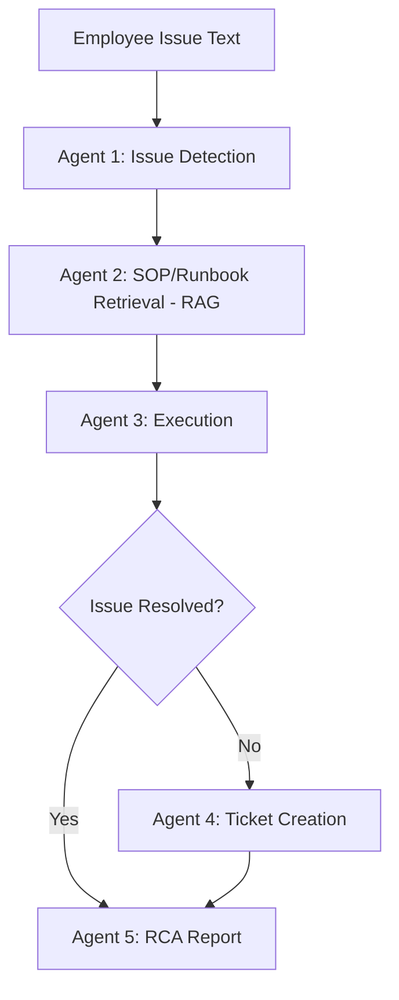

# Enterprise IT Support & RCA Agent

AI-powered multi-agent system that detects IT issues, retrieves troubleshooting
steps via RAG, attempts automated remediation, raises tickets when it can't
resolve something, and generates a Root Cause Analysis (RCA) report — with
each agent's progress streamed live to the UI as it happens.

Built for the **HCLTech–OpenAI Agentic AI Hackathon** (Track 2 — Internal Operations).

## Status

- [x] Shared agent state (Pydantic model)
- [x] Agent 1 — Issue Detection (OpenAI `gpt-4o-mini`, structured JSON output)
- [x] Agent 2 — SOP/Runbook Retrieval (RAG via OpenAI embeddings + cosine similarity)
- [x] Agent 3 — Execution Agent (simulated remediation, least-privilege auto-resolve)
- [x] Agent 4 — Ticket Agent (in-memory store, LLM-based team routing)
- [x] Agent 5 — RCA Agent (root cause, resolution summary, prevention)
- [x] LangGraph wiring — full state machine with conditional branching
- [x] FastAPI backend — `/resolve-issue` (sync) and `/resolve-issue-stream` (SSE)
- [x] Streamlit UI — live per-agent progress via Server-Sent Events

## Architecture



## Tech Stack

- **Python 3.11+**
- **Pydantic** — shared `AgentState` passed between all agents
- **OpenAI API** (`gpt-4o-mini` for reasoning, `text-embedding-3-small` for RAG)
- **LangGraph** — agent orchestration as a state machine with conditional edges
- **FastAPI** — REST API + Server-Sent Events streaming
- **Streamlit** — live demo UI, renders each agent's step as it completes

### Note on RAG implementation
ChromaDB's default local embedding backend (`onnxruntime`) had a Windows DLL
conflict in this environment. Rather than fight the environment, retrieval is
implemented directly: OpenAI embeddings + manual cosine similarity, no vector
DB dependency. Same underlying technique, fewer moving parts.

## Project Structure
├── agent/

│   ├── state.py

│   ├── graph.py

│   └── nodes/

│       ├── issue_detection.py

│       ├── sop_retrieval.py

│       ├── execution.py

│       ├── ticket.py

│       └── rca.py

├── tools/

│   └── action_tools.py

├── storage/

│   └── tickets_store.py

├── knowledge_base/

│   └── docs/              # 4 runbooks: VPN, password reset, access denied, service down

├── main.py                 # FastAPI app

├── streamlit_app.py         # Demo UI

├── test_*.py                # One test script per build step

├── requirements.txt

└── .env                     # not committed — holds OPENAI_API_KEY


## Setup

```bash
python -m venv venv
venv\Scripts\activate          # Windows
pip install -r requirements.txt
```

Create `.env` in the root:

## Running the demo

Terminal 1:
```bash
uvicorn main:app --reload
```

Terminal 2:
```bash
streamlit run streamlit_app.py
```

Open `http://localhost:8501`, describe an IT issue, watch each agent report
its progress live, then view the final RCA report.

## Design decisions worth noting

- **Least-privilege automation**: only `vpn_auth_failure` and `password_reset`
  are auto-resolvable. Everything else (`access_denied`, `service_down`,
  `unknown`) always routes to a human, even though a fix might be technically
  possible — mirrors how real enterprise automation is scoped.
- **Storage abstraction**: tickets live in a plain in-memory dict
  (`storage/tickets_store.py`). Swapping to MongoDB later only touches this
  one file — nothing else needs to change.
- **Streaming over blocking**: the UI uses LangGraph's `.stream()` +
  FastAPI's `StreamingResponse` (SSE) so the multi-agent reasoning is visible
  step-by-step, not hidden behind one blocking call.

## Known limitation / next planned improvement

Auto-resolution currently always succeeds on the first attempt — there's no
check for whether the *same* issue type repeats for the *same* user shortly
after being "resolved." A real system would treat a repeat as a sign the
automated fix didn't actually work and escalate to a human instead. Planned
as the next addition.

## Author

Vivekanand — built for HCLTech–OpenAI Agentic AI Hackathon, Track 2
